# Edge Intelligence for Resource Management in Hybrid RF-VLC Internet of Vehicles

**IEEE Internet of Things Journal · Research Code**  
> Notebook implementation and simulation artifacts for topology-aware resource management in hybrid radio-frequency (RF) and visible-light communication (VLC) vehicular networks.

---

[](https://www.python.org/)
[](https://pytorch.org/)
[](https://pyg.org/)
[](https://gymnasium.farama.org/)
[](https://jupyter.org/)

> **Arif Raza, Uddin Md. Borhan, M. Wasim Abbas Ashraf, Mohammad Muhiuddin Abro, Jie Chen, and Lu Wang**  
> Shenzhen University · Applied Science Private University · National University of Computer and Emerging Sciences  
> Corresponding authors: Lu Wang and Jie Chen

---

## Overview

This repository provides a simulation-oriented implementation of **Graph Edge Soft Actor-Critic (GESAC)** for resource control in a hybrid RF-VLC Internet of Vehicles (IoV). The environment models mobile vehicles, macro RF base stations, VLC access points, channel assignment, user association, and tier-specific link behavior over an urban deployment.

GESAC treats the communication infrastructure as a graph. Each RF or VLC access point becomes a node, nearby infrastructure nodes are connected, and an edge-update graph neural network processes their coupled state before the Soft Actor-Critic policy selects continuous resource actions.

The repository focuses on four questions:

1. **Topology-aware control:** Can graph message passing use infrastructure relationships more effectively than a flattened network state?
2. **Joint resource decisions:** How should transmit power and channel share be coordinated across RF and VLC nodes?
3. **Mobility-aware association:** How do changing vehicle locations, link quality, and node load affect connectivity and resource use?
4. **Robust evaluation:** How does the learned policy respond to different algorithms, graph encoders, neighborhood sizes, vehicle loads, random seeds, and optical geometries?

The code is organized as Jupyter notebooks. `codes/vlc.ipynb` contains the primary GESAC experiment, while the other notebooks reproduce baselines and sensitivity studies.

---

## Hybrid RF-VLC System Model

<p align="center">
  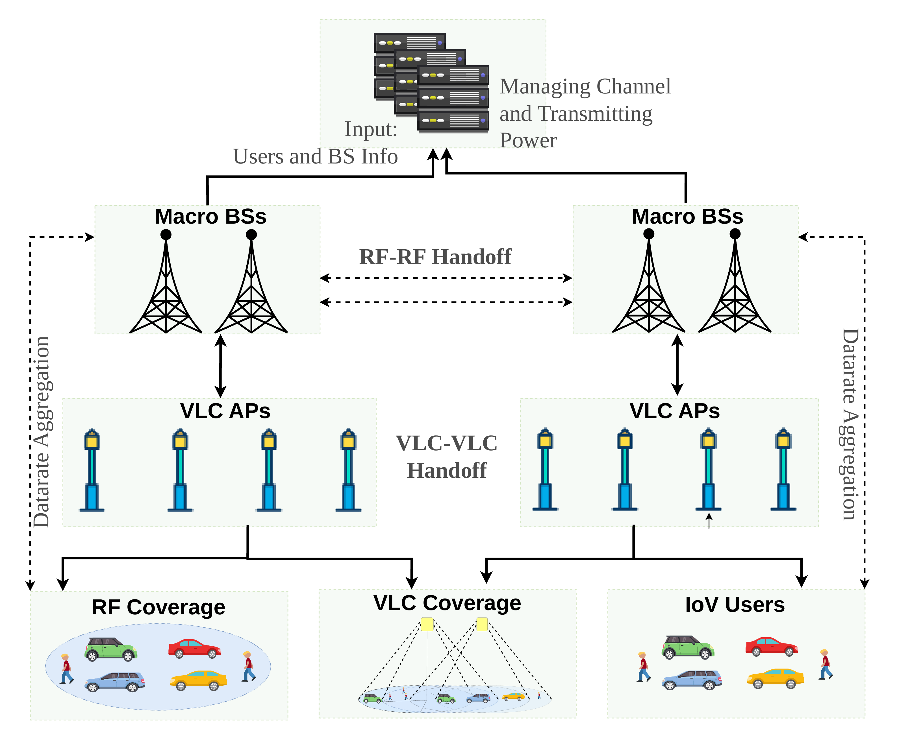
</p>

The simulated network combines two complementary access tiers:

- **RF macro base stations** provide broad coverage and support vehicles when optical connectivity is unavailable.
- **VLC access points** provide localized optical links with separate channel and propagation behavior.
- **Mobile IoV users** move between waypoints, generate changing demand, and may obtain RF and VLC service during the same simulation step.
- **The edge controller** observes the infrastructure state, allocates power and channel shares, and lets the environment update associations and link metrics.

The default notebook creates a `2000 m × 2000 m` area with 36 infrastructure nodes: 4 RF base stations and 32 VLC access points. One hundred vehicles move through the deployment in the main benchmark.

---

## GESAC Architecture

<p align="center">
  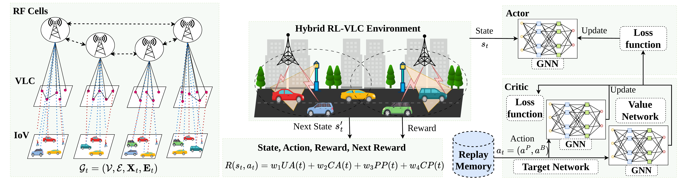
</p>

```text
Environment observation
  shape: (36 nodes, 12 features)
        |
        v
Graph construction
  append RF/VLC one-hot type: 12 + 2 = 14 node features
  connect each node to five nearest neighbors in both directions
  initialize a learned 16-dimensional state for every directed edge
        |
        v
ENGNN actor and critics
  two edge-update/message-passing layers
  hidden width: 32
  ReLU + layer normalization + dropout
        |
        v
SAC policy
  output per node: [power_fraction, channel_fraction]
  joint action shape: (36, 2)
  squashed and rescaled to the environment bounds
        |
        v
Simulator transition
  allocate RF/VLC resources
  associate users
  compute SINR, data rate, power, bandwidth, and delay proxy
  move vehicles and return the next observation
```

---

## Method Details

### 1. Mobile Hybrid-Network Environment

**Classes:** `Channel`, `BaseStation`, `User`, `MobileNetwork`  
**Primary notebook:** `codes/vlc.ipynb`

The Gymnasium environment maintains the physical and scheduling state of both access technologies. Its main responsibilities include:

- waypoint-based vehicle movement;
- RF and VLC path-loss calculations;
- carrier and channel assignment;
- tier-specific SINR and spectral-efficiency calculations;
- resource-dependent coverage updates;
- RF/VLC user association;
- aggregate data-rate, power, bandwidth, and delay-proxy reporting.

The default environment is instantiated as:

```python
MobileNetwork(
    num_base_stations=36,
    num_users=100,
    num_channels=775,
    area_size=2000,
    bs_loc=BASE_STATION_LOCATIONS,
    max_steps=200,
)
```

RF nodes use frequencies from 3.4 to 3.8 GHz. VLC channels are placed around a 500 THz optical carrier. The implementation uses separate power budgets, channel pools, and path-loss routines for the two tiers.

---

### 2. Graph State Construction

Every access point contributes a normalized 12-value observation vector. In the uploaded implementation, these channels describe:

```text
[node_type,
 transmit_power,
 channel_utilization,
 coverage_utilization,
 channel_deficit,
 nearby_user_potential,
 mean_user_speed,
 required_power,
 mean_radial_velocity,
 speed_variance,
 mean_neighbor_power,
 user_density]
```

`SACAgent.create_graph_data()` adds a two-value RF/VLC one-hot encoding, producing 14 input channels per graph node.

`SACAgent._compute_edge_index()` builds a static graph from base-station coordinates. The nearest-neighbor search requests six entries, removes the node itself, and adds both directions for the remaining five neighbors.

```python
nbrs = NearestNeighbors(n_neighbors=6).fit(bs_locations)

for node in range(num_nodes):
    for neighbor in indices[node][1:]:
        edges.append([node, neighbor])
        edges.append([neighbor, node])
```

The graph topology stays fixed for a given deployment, while node values change with mobility, load, channel use, and the preceding resource action.

---

### 3. Edge-Update Graph Encoder

**Classes:** `ENGNNLayer`, `GNNActor`, `GNNCriticQ`, `GNNCriticV`

An `ENGNNLayer` first revises every directed edge from the source node, destination node, and previous edge state. It then constructs messages and aggregates them at each receiving node:

```python
e_next = edge_mlp(concat(x_source, x_target, e))
message = message_mlp(concat(x_neighbor, e_next))
aggregate = scatter_sum(message, receiver_index)
x_next = node_mlp(concat(x, aggregate))
```

The actor and critics each use two of these layers. Their edge states are trainable 16-dimensional embeddings, and node messages use a hidden width of 32. Layer normalization and dropout are applied between graph updates.

The actor produces a Gaussian mean and log standard deviation for each node. Reparameterized samples pass through `tanh` before being mapped into the resource-action interval.

---

### 4. Continuous Resource Actions

For node `i`, the actor emits two values:

```text
action[i, 0] -> fraction of the node's transmit-power budget
action[i, 1] -> fraction of the node's available channel budget
```

The environment converts these normalized controls into tier-specific resources:

```python
transmit_power_i = power_fraction_i * maximum_power_i
requested_channels_i = int(channel_fraction_i * maximum_channels_i)
```

Requested channels are clipped by the node's available pool and the remaining RF or VLC system capacity. The environment then associates each vehicle with nearby resources, evaluates the resulting links, and calculates per-tier throughput.

---

### 5. Reward and Learning Loop

The notebook reward combines three implemented signals and a capacity-limit adjustment:

```python
reward = (
    4.0 * normalized_association_score
    + 4.0 * normalized_channel_match
    - 3.0 * normalized_power_deviation
    + capacity_penalty
)
reward = clip(reward, -10, 10)
```

This favors effective association and channel-to-load matching while penalizing power that differs from the estimated coverage requirement. A further penalty is applied when the pre-allocation RF or VLC request exceeds the corresponding channel pool.

The SAC agent uses:

- a replay buffer of `100,000` transitions;
- a batch size of `512`;
- twin graph Q-functions;
- a graph value network and softly updated target value network;
- an automatically learned entropy coefficient;
- random environment actions during the initial exploration period;
- a default training horizon of `100,000` steps.

During evaluation, `agent.test()` runs five episodes by default and reports the mean score with its standard deviation.

---

## Repository Layout

```text
rf-vlc-iov-main/
├── README.md
├── codes/
│   ├── vlc.ipynb                 <- primary GESAC experiment
│   ├── vlc_sac.ipynb             <- SAC baseline
│   ├── vlc_ppo.ipynb             <- PPO baseline
│   ├── vlc_ddpg.ipynb            <- DDPG baseline
│   ├── vlc_td3.ipynb             <- TD3 baseline
│   ├── vlc_gcn.ipynb             <- graph-convolution encoder comparison
│   ├── vlc_gat.ipynb             <- graph-attention encoder comparison
│   ├── vlc_k.ipynb               <- graph-neighborhood sensitivity
│   ├── vlc_users.ipynb           <- vehicle-load sensitivity
│   ├── vlc_ssed_7.ipynb          <- GESAC seed-7 run
│   ├── vlc_seed_89.ipynb         <- GESAC seed-89 run
│   └── fov_semi/
│       ├── fov_30/               <- optical FOV experiments and baselines
│       ├── fov_60/               <- optical FOV experiments and baselines
│       ├── semi_15/              <- transmitter semi-angle experiments
│       └── semi_30/              <- transmitter semi-angle experiments
├── figs/
│   ├── map_vlc.png               <- OSM-derived deployment map
│   ├── vlc_model.png             <- hybrid RF-VLC system model
│   ├── vlc_pro.png               <- GESAC processing pipeline
│   └── vlc_ray.png               <- VLC propagation geometry
├── graphs/
│   ├── bandwidth_comparison.png
│   ├── data_rate_ua.png
│   ├── latency_comparison.png
│   ├── mean_episode_reward.png
│   ├── rf_vlc_power2.png
│   ├── vlc_fov_comparison.png
│   └── vlc_power_comparison.png
└── results/
    ├── trainlogger.txt
    ├── seed_7_trainlogger.txt
    ├── seed_89_trainlogger.txt
    ├── k_sensitivity_summary.csv
    ├── user_sensitivity_summary.csv
    ├── gat/
    ├── gc/
    └── fod_semi/                 <- stored optical-study logs
```

---

## Requirements

The notebooks were created with Python 3.10 and require the following main packages:

- Python 3.10
- JupyterLab or Jupyter Notebook
- NumPy
- Matplotlib
- Gymnasium
- PyTorch
- PyTorch Geometric
- `torch-scatter`
- scikit-learn
- Stable-Baselines3
- Shimmy

Create an isolated environment:

```bash
conda create -n rf-vlc-iov python=3.10 -y
conda activate rf-vlc-iov

python -m pip install --upgrade pip
python -m pip install jupyterlab numpy matplotlib scikit-learn gymnasium
python -m pip install torch torch-geometric torch-scatter
python -m pip install stable-baselines3 shimmy
```

> `torch-scatter` must be compatible with the installed PyTorch and CUDA versions. If the generic command cannot resolve a wheel, use the installation selector in the [PyTorch Geometric documentation](https://pytorch-geometric.readthedocs.io/en/latest/install/installation.html).

---

## Quick Start

### 1. Clone the repository

```bash
git clone https://github.com/szu-ai/rf-vlc-iov.git
cd rf-vlc-iov
```

### 2. Launch JupyterLab

```bash
jupyter lab
```

Open `codes/vlc.ipynb`, select the Python 3.10 environment, and choose **Run All Cells**.

The final cell constructs the default environment, trains GESAC for 100,000 steps, and evaluates the learned policy:

```python
env = create_mobile_network_env()

agent = SACAgent(
    env=env,
    learning_rate=2e-4,
    bs_loc=bs_loc,
    memory_size=int(1e5),
    batch_size=512,
    initial_random_steps=1000,
    seed=42,
)

agent.train(num_frames=100000)
agent.test(num_episodes=5)
```

### 3. Execute the main notebook without the browser

```bash
MPLBACKEND=Agg jupyter nbconvert \
  --to notebook \
  --execute codes/vlc.ipynb \
  --output vlc.executed.ipynb \
  --ExecutePreprocessor.timeout=-1
```

### 4. Run the algorithm baselines

Open or execute the corresponding notebook:

```bash
MPLBACKEND=Agg jupyter nbconvert --to notebook --execute codes/vlc_sac.ipynb  --output vlc_sac.executed.ipynb  --ExecutePreprocessor.timeout=-1
MPLBACKEND=Agg jupyter nbconvert --to notebook --execute codes/vlc_ppo.ipynb  --output vlc_ppo.executed.ipynb  --ExecutePreprocessor.timeout=-1
MPLBACKEND=Agg jupyter nbconvert --to notebook --execute codes/vlc_ddpg.ipynb --output vlc_ddpg.executed.ipynb --ExecutePreprocessor.timeout=-1
MPLBACKEND=Agg jupyter nbconvert --to notebook --execute codes/vlc_td3.ipynb  --output vlc_td3.executed.ipynb  --ExecutePreprocessor.timeout=-1
```

### 5. Run graph-encoder comparisons

```bash
MPLBACKEND=Agg jupyter nbconvert --to notebook --execute codes/vlc_gcn.ipynb --output vlc_gcn.executed.ipynb --ExecutePreprocessor.timeout=-1
MPLBACKEND=Agg jupyter nbconvert --to notebook --execute codes/vlc_gat.ipynb --output vlc_gat.executed.ipynb --ExecutePreprocessor.timeout=-1
```

### 6. Run sensitivity experiments

| Study | Notebook or directory | Variable |
| --- | --- | --- |
| Graph neighborhood | `codes/vlc_k.ipynb` | Number of nearby infrastructure nodes |
| Vehicle load | `codes/vlc_users.ipynb` | Number of mobile users |
| Random seed | `codes/vlc_ssed_7.ipynb`, `codes/vlc_seed_89.ipynb` | Training initialization and trajectories |
| Receiver field of view | `codes/fov_semi/fov_30/`, `codes/fov_semi/fov_60/` | Optical receiver acceptance angle |
| Transmitter semi-angle | `codes/fov_semi/semi_15/`, `codes/fov_semi/semi_30/` | VLC emission geometry |

---

## Default Experiment Configuration

| Parameter | Repository default |
| --- | ---: |
| Simulation area | `2000 × 2000 m²` |
| RF base stations | `4` |
| VLC access points | `32` |
| Vehicles | `100` |
| Observation shape | `36 × 12` |
| Graph input shape after type augmentation | `36 × 14` |
| Continuous action shape | `36 × 2` |
| Neighbors requested per node | `5` excluding self |
| Edge embedding width | `16` |
| ENGNN layers | `2` |
| Graph hidden width | `32` |
| Episode length | `200` steps |
| Training horizon | `100,000` steps |
| Replay capacity | `100,000` |
| Batch size | `512` |
| Learning rate | `2 × 10⁻⁴` |
| Discount factor | `0.99` |
| Target-update coefficient | `0.01` |
| Initial random steps | `1,000` |
| Main random seed | `42` |

These values describe `codes/vlc.ipynb`. Individual baseline and sensitivity notebooks may override them.

---

## Network and Propagation Visuals

<p align="center">
  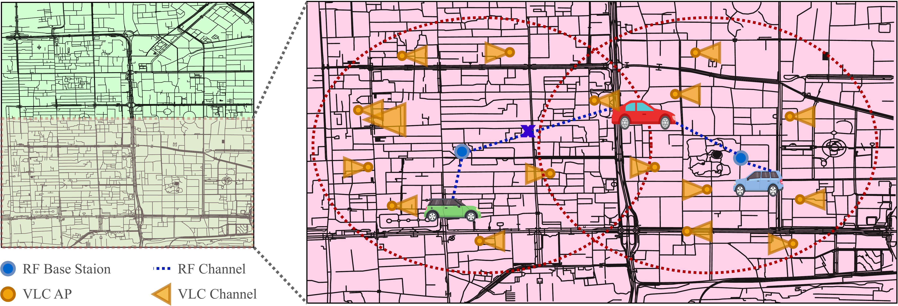
</p>

The deployment visual places RF sites and VLC access points over an urban map. The notebooks use a fixed list of infrastructure coordinates and move users between sampled waypoints inside the simulation boundary.

<p align="center">
  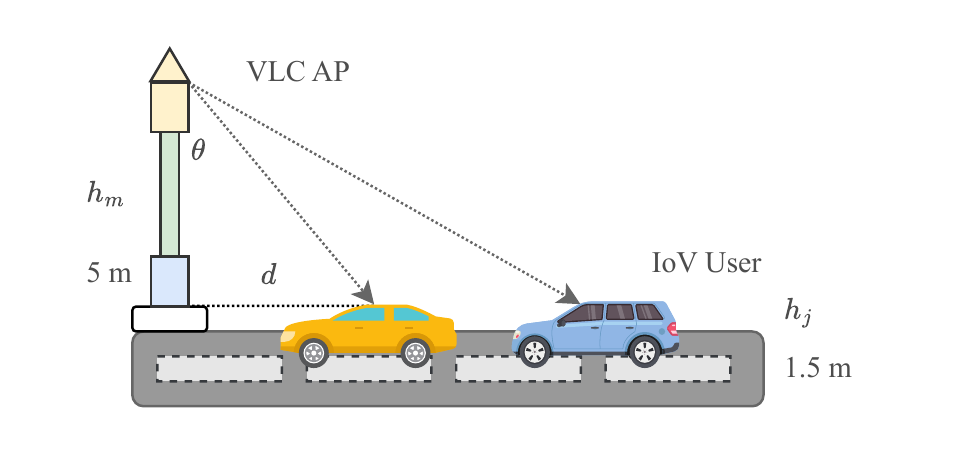
</p>

The optical model relates access-point height, receiver height, horizontal separation, incidence geometry, field of view, and transmitter semi-angle. The dedicated experiment folders vary receiver and transmitter angles to study how coverage geometry changes resource behavior.

---

## Representative Results

The following values summarize the representative seed-42 simulator records associated with the supplied plots. They compare the implemented runs under a common observation, action definition, and nominal training budget.

| Method | Horizon-average reward | Aggregate throughput (Mbps) | Average delay proxy (ms) |
| --- | ---: | ---: | ---: |
| **GESAC** | **0.1710** | **2365** | **15.62** |
| SAC | 0.0118 | 1834 | 25.20 |
| PPO | -0.0058 | 596 | 76.12 |
| DDPG | -0.0110 | 1141 | 65.46 |
| TD3 | 0.0070 | 1417 | 45.41 |

These results should be interpreted as simulator evidence, not as a statistical ranking of the algorithms. The baseline comparison is represented by one training seed, and the reported delay is a simulator-defined proxy rather than packet-level latency measured on deployed hardware.

### Training behavior and delay proxy

<p align="center">
  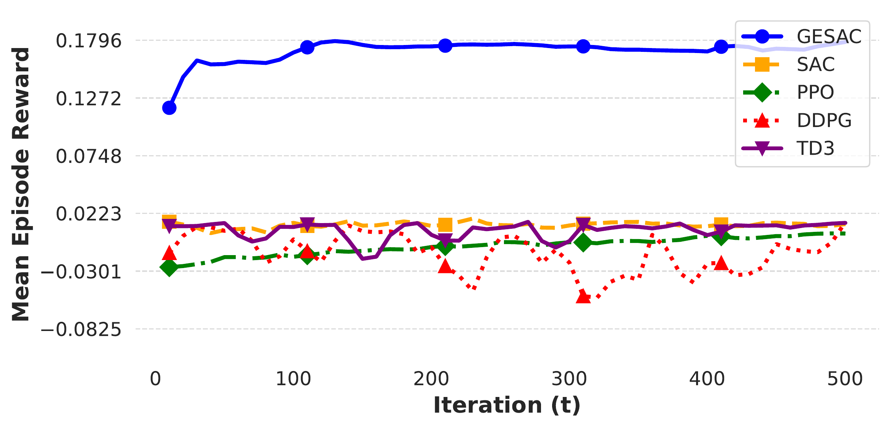
  &nbsp;
  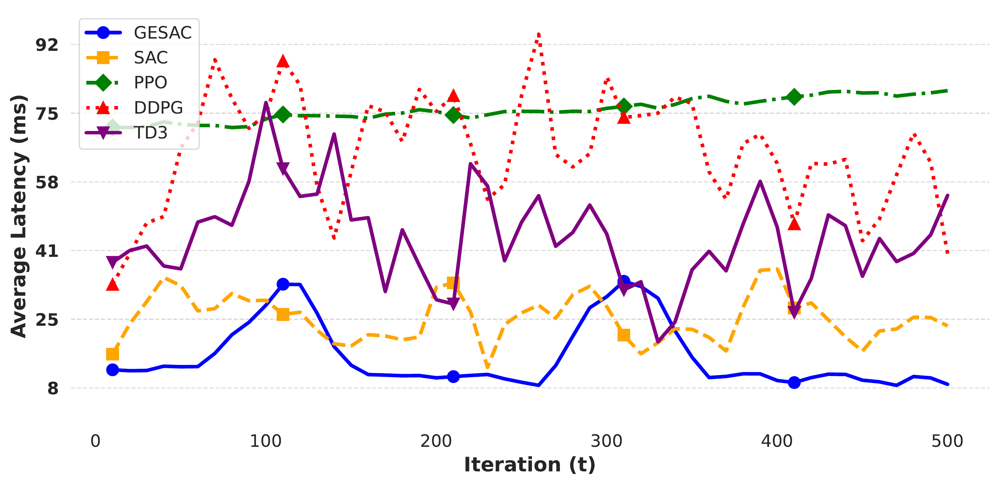
</p>

**Left:** GESAC converges to a higher reward region in the representative benchmark, while the displayed non-graph baselines remain closer to zero under the same reward definition.  
**Right:** The GESAC run maintains the smallest delay proxy over most of the shown horizon; the metric combines link distance, fixed processing terms, resource sharing, and achieved rate.

### Throughput, association, and bandwidth

<p align="center">
  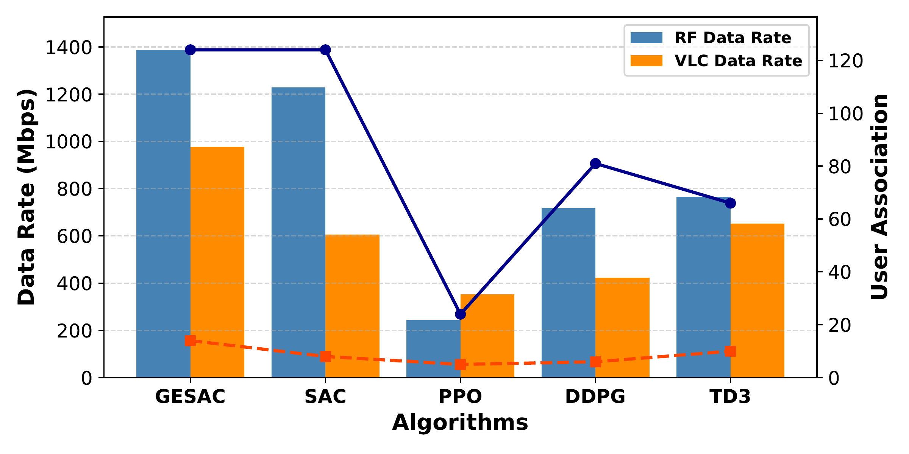
  &nbsp;
  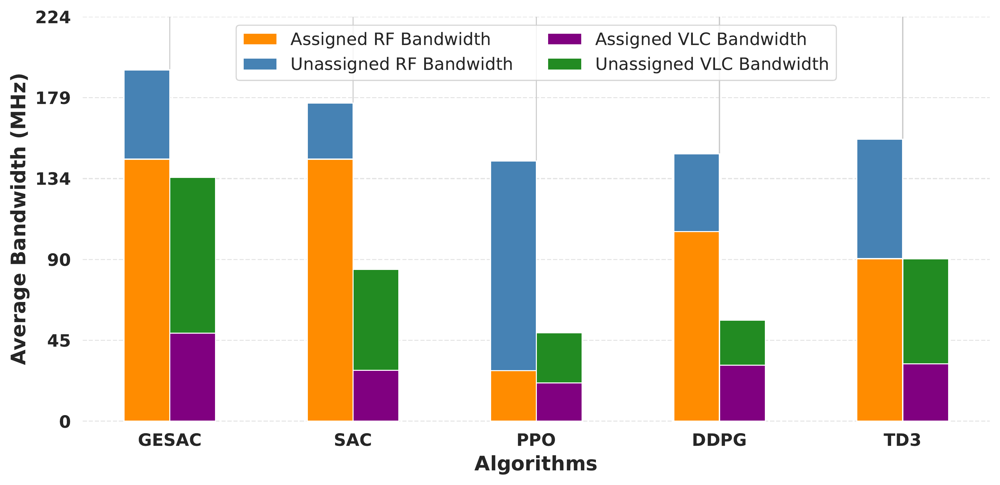
</p>

**Left:** The chart separates RF and VLC throughput and overlays the number of recorded association events for each tier. An event is an established link, so mobility and simultaneous RF/VLC service can produce more events than unique vehicles.  
**Right:** Assigned and unassigned bandwidth reveal the different operating points learned by the five controllers; the stacked values come directly from simulator logs.

### Optical sensitivity and power trade-off

<p align="center">
  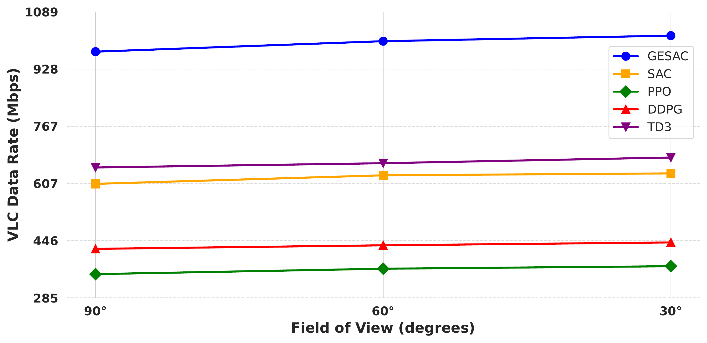
  &nbsp;
  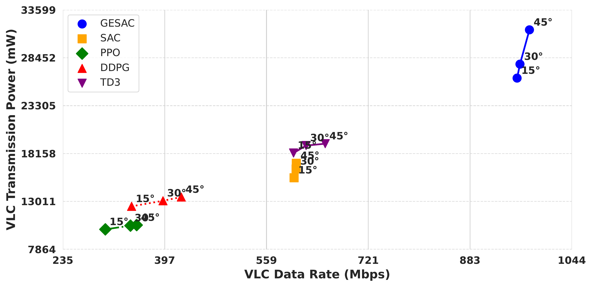
</p>

The optical studies evaluate paired field-of-view and transmitter semi-angle configurations. Because the two angles are changed together in these runs, the plots characterize combined optical geometry rather than the isolated effect of either angle.

<p align="center">
  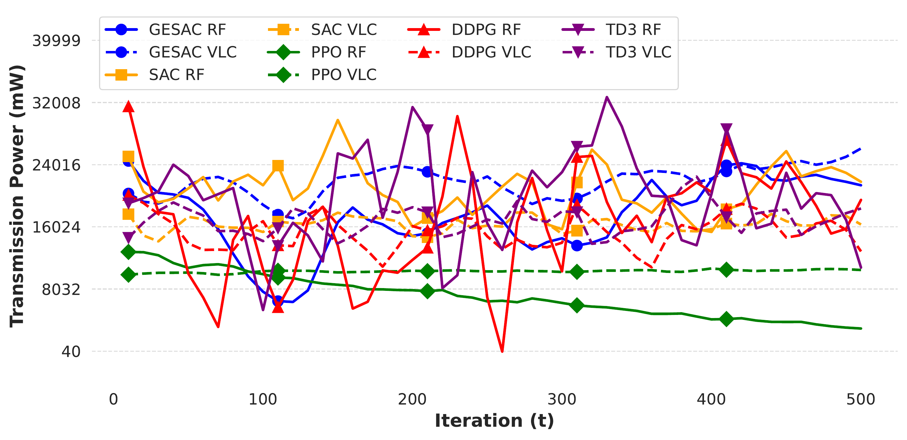
</p>

GESAC achieves the highest representative throughput but does not minimize absolute transmit power. The results therefore show a throughput-power trade-off rather than an across-the-board energy reduction.

---

## Additional Sensitivity Results

### Graph neighborhood

| Neighbors (`k`) | Final reward | Throughput (Mbps) | Delay proxy (ms) |
| ---: | ---: | ---: | ---: |
| 2 | 0.1666 | **2533.3** | **7.77** |
| 4 | 0.1805 | 2501.7 | 7.86 |
| 6 | 0.1762 | 2450.6 | 7.84 |
| 8 | **0.1853** | 2445.7 | 8.19 |

The neighborhood sweep illustrates that a larger graph neighborhood does not improve every metric simultaneously. The best reward, throughput, and delay values occur at different settings.

### Vehicle load

| Vehicles | RF rate (Mbps) | VLC rate (Mbps) | RF power (mW) | VLC power (mW) | Delay proxy (ms) |
| ---: | ---: | ---: | ---: | ---: | ---: |
| 50 | 763.09 | 490.00 | 33385.77 | 31732.54 | 4.35 |
| 100 | 1476.18 | 891.54 | 22109.34 | 24736.90 | 9.42 |
| 150 | 1141.88 | 1163.70 | 15617.24 | 21224.26 | 47.23 |
| 200 | 445.52 | 1855.44 | 1035.15 | 28324.92 | 73.78 |

As the simulated load rises, the operating point moves toward heavier VLC use and the delay proxy increases. The totals reflect aggregate system behavior, not per-vehicle guarantees.

### Random-seed check

| Seed | Final rate (Mbps) | Power (mW) | Delay proxy (ms) |
| ---: | ---: | ---: | ---: |
| 7 | 2475.56 | 48219.55 | 9.90 |
| 42 | 2501.73 | 47617.16 | 7.86 |
| 89 | 2120.39 | 59006.16 | 22.26 |
| **Mean ± std.** | **2365.89 ± 213.02** | **51614.29 ± 6408.63** | **13.34 ± 7.79** |

The spread across three GESAC runs shows that initialization and sampled training trajectories materially affect the final checkpoint.

---

## Reproducibility Notes

- Notebook outputs are written relative to the process working directory. Use distinct output names or separate working directories when running several experiments.
- The main notebook enables interactive plotting. Set `MPLBACKEND=Agg` for non-interactive execution.
- The replay buffer stores current and next node observations; long runs can require substantial host memory.
- CUDA is optional. The custom GESAC notebook selects a GPU when PyTorch detects one and otherwise runs on CPU.
- The archive contains pre-generated plots and logs, but retraining is stochastic even when a seed is fixed across NumPy, Python, and PyTorch.
- The current simulator uses a centralized controller, fixed infrastructure coordinates, simplified mobility, and analytical link models. It is not a packet-level network emulator.

---

## Troubleshooting

### `ModuleNotFoundError: No module named 'torch_scatter'`

Install the wheel that matches the exact PyTorch and CUDA versions in the active environment. Follow the [PyTorch Geometric installation matrix](https://pytorch-geometric.readthedocs.io/en/latest/install/installation.html) when a generic `pip install torch-scatter` attempts an unsupported source build.

### PyTorch reports a CUDA or shared-library mismatch

Reinstall PyTorch and the PyG extension packages from mutually compatible wheels. Verify the environment before launching Jupyter:

```bash
python -c "import torch; print(torch.__version__, torch.version.cuda, torch.cuda.is_available())"
python -c "import torch_geometric, torch_scatter; print(torch_geometric.__version__)"
```

### Notebook execution times out

The main run contains 100,000 environment steps. Use `--ExecutePreprocessor.timeout=-1` with `nbconvert`, or reduce `agent.train(num_frames=...)` for a short functional check.

### No plot window appears on a remote machine

Run with `MPLBACKEND=Agg` and inspect the executed notebook or generated PNG files instead of requesting an interactive display.

### Results from two notebooks overwrite one another

Several notebooks use common logger or plot filenames. Rename the outputs in the final cells or execute each study from a separate working directory.

### Training runs out of memory

Reduce `memory_size` and `batch_size` in the agent configuration. These changes affect the training setup and should be reported with any new results.

---

## Scope and Limitations

This repository is intended for simulation research. The present implementation assumes fixed infrastructure locations and uses centralized graph inference. Its optical model simplifies vehicle orientation, blockage, and interference between VLC access points. The simulator delay metric is a rate-and-load proxy, not an end-to-end measurement from a real network stack. Baseline plots are representative single-seed runs unless a table explicitly reports multiple seeds.

Future extensions can evaluate unseen deployments, packet-level queues, time-varying optical orientation, blockage-aware VLC links, decentralized inference, and measured execution latency on edge hardware.

